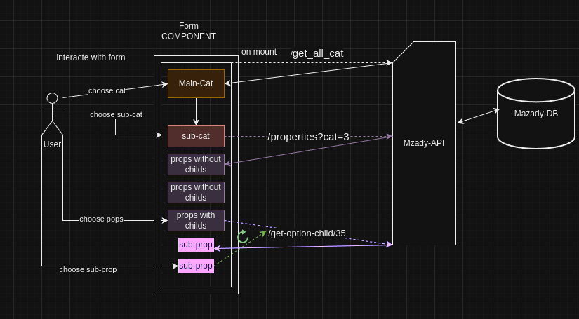

## **Mazaady Frontend Task System Design Guide**

### 1. **Overview**:

A dynamic form where dropdown values depend on the previous selections, with the aim to assess coding techniques,
quality, and testing methods.

---

### 2. **Components**:

#### **Form Component**:

- Two primary dropdowns: Main Category and Sub-category.
- Additional dropdowns are generated based on the properties of the chosen sub-category.

---

### 3. **Data Flow**:

#### **Fetch Main Categories**:

- On component initialization, fetch the main categories using the `get_all_cats` endpoint.
- Populate the Main Category dropdown with these values.

#### **Get Sub-categories**:

- When a main category is selected:
  - Populate the Sub-category dropdown with these values.

#### **Fetch Properties and Sub-properties**:

- On selecting a sub-category:
  - Fetch the sub-category's properties using the `properties` endpoint, passing the selected category ID as a search param.
- For each property:
  - Display as a dropdown.
  - Append an "other" option.
  - If "other" is selected, display an input field for custom value entry.
- If a property is a parent to other properties (like brand -> model), then selecting a value in the property dropdown
  should generate a child property dropdown.

##### **Data Flow Diagram**:

## 

### 4. **UI/UX Design**:

#### **Form Layout**:

- Main Category Dropdown: Placed prominently as the first element of the form.
- Sub-category Dropdown: Appears below the Main Category once a selection is made.
- Property Dropdowns: Dynamically generated below Sub-category dropdown based on the chosen sub-category.
- Submit Button: Positioned below all dropdowns.

#### **Feedback**:

- Loading indicators should be displayed while fetching data from the APIs.
- Errors during fetch operations should be gracefully handled and displayed to the user.

---

### 5. **APIs & Integration**:

#### **Endpoints**:

- **Main Categories**: `https://staging.mazaady.com/api/v1/get_all_cats`

  - Predicted Response:

    ```json
    [
      {
        "id": 1,
        "name": "Electronics",
        "description": "Electronic devices and gadgets.",
        "children": [
          {
            "id": 10,
            "name": "Cars",
            "description": "Cars and automobiles."
          },
          {
            "id": 11,
            "name": "Mobile Phones",
            "description": "Mobile phones and accessories."
          },
          {
            "id": 12,
            "name": "Computers",
            "description": "Computers and accessories."
          }
        ]
      },
      {
        "id": 2,
        "name": "Clothing",
        "description": "Apparel and clothing items.",
        "children": [
          {
            "id": 13,
            "name": "Shirts",
            "description": "Shirts and tops."
          },
          {
            "id": 14,
            "name": "Pants",
            "description": "Pants and trousers."
          },
          {
            "id": 15,
            "name": "Shoes",
            "description": "Shoes and footwear."
          }
        ]
      }

      // ... more categories
    ]
    ```

- **Sub-categories/Properties**: `https://staging.mazaady.com/api/v1/properties?cat=<CATEGORY_ID>`

  - Predicted Response:

    ```json
    [
      {
        "id": 20,
        "parent": 10,
        "name": "Brand",
        "type": "dropdown",
        "options": [
          { "id": 1, "name": "BMW", "hasChild": true },
          { "id": 2, "name": "Ford", "hasChild": true },
          { "id": 3, "name": "Fiat", "hasChild": true }

          // ... more properties
        ]
      },
      {
        "id": 21,
        "name": "Color",
        "parent": 10,
        "type": "dropdown",
        "options": [
          { "id": 1, "name": "Black", "hasChild": false },
          { "id": 2, "name": "White", "hasChild": false },
          { "id": 3, "name": "Red", "hasChild": false }

          // ... more properties
        ]
      }
    ]
    ```

- **Property Options**: `https://staging.mazaady.com/api/v1/get-options-child/<OPTION_ID>`

  - Predicted Response:

  ```json
  [
    {
      "id": 3,
      "name": "Model",
      "type": "dropdown",
      "parent": 10,
      "options": [
        { "id": 1, "name": "Ford-12", "hasChild": true },
        { "id": 2, "name": "Ford-13", "hasChild": true },
        { "id": 3, "name": "Ford-14", "hasChild": true }

        // ... more properties
      ]
    }

    // ... more properties
  ]
  ```

#### **Security**:

- Before making requests, ensure you have the required authentication tokens or private keys.

---

### 6. **Submission & Display** :

- **Submission**:
  - When the user clicks the submit button, gather all selected values.
- **Display**:
  - Present the gathered values (key, value) in a well-structured table below the form or on a new page/view.

---
